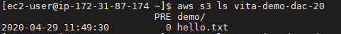
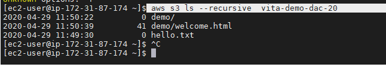
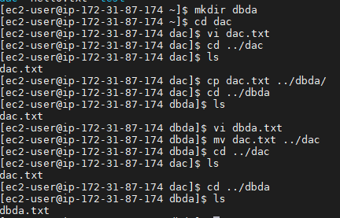
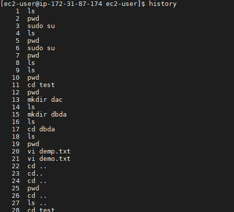
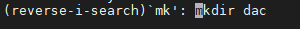

# To connect s3 bucket to ec2 service:
To connect ec2 and s3 we create iam role with policies

```
iam roles service -> identification (id dikhao)role:identity access
        ^
        |
      Rules ->who can access(authorisation)
        ^
        |
 called as policies
```

how to do it  ->
```
Iam 
Select service (ec2)
Then service can create or select default one (selected s3 full access)
Then attach it to ec2 cant attach ec2
Ec2 ->action-> instance setting -> add or replace iam role ->select vita demo
Role arn asked 
```
___
# commands

any aws command to run
aws `service-name` command option
eg 
aws s3 ls -> to list buckets
  
To list bucket  : aws s3 ls
File in the bucket: aws s3 ls bucket name


aws s3 ls --recursive  vita-demo-dac-20



**any directory with “." is hidden**<br/>

cp mv rm



History  used commands



Ctrl +R
 
Again mk ctrl +r to serach mkdir used in history its stacked type  last command 


